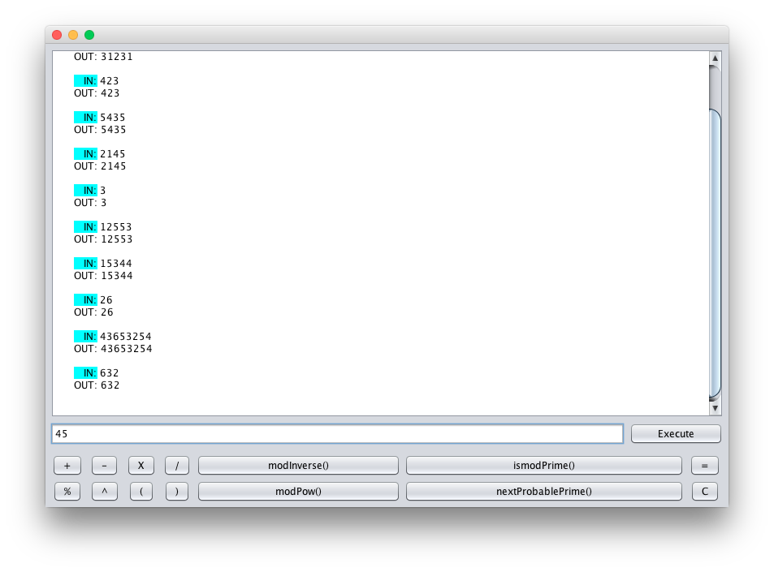

# [Java BigInteger Calculator](https://github.com/ismtabo/cc_bigintegers)

Práctica sobre BigIntegers en Java para la asignatura de **Códigos y Criptografía** de la mención de _Computación_ en el **Grado de Ingeniería Informática** de la **Escuela Técnica Superior de Ingenería Informática** ([ETSII](inf.uva.es)).

##Cómo Ejecutar
#### Desde Netbeans:
Añadir proyecto contenido en el directorio ``app/``

## Uso:
Esta calculadora ha sido diseñada para trabajar con números enteros, especialmente para aritmética modular.

#### Operaciones:
La calculadora permite las siguientes operaciones:
  - **Suma:** ``a + b``
  - **Resta:** ``a - b``
  - **Multiplicación:** ``a * b``
  - **División Entera:** ``a / b``
  - **Exponenciación:** ``a ^ b``
  - **Módulo:** ``a % b``
  - **Inverso Modular:** ``a.modInverse(b)`` = ``a ^ -1 % b``
  - **Potencia Modular:** ``a.modPow(b,c)`` = ``a ^ b % c``
  - **Test de Coprimalidad:** ``a.isProbablePrime(b)``
  - **Siguiente Probable Primo:** ``a.nextProbablePrime()``

#### Paréntesis:
Las operaciones binarias se pueden anidar con paréntesis.
Ejemplo: ``((a+b)*c)-(d % e)^f``

#### Uso de variables:
Para definir una variable: ``nombreVariable = expresión``
Para usar una variable: ``nombreVariable``
Se pueden anidar en paréntesis.

##Contenido
[Proyecto Java](app/)

## Finalidad
Dominar el uso de la precisión aritmética arbitraria en java.

Autores
----
Sergio García: [garciparedes](https://github.com/garciparedes)
Ismael Taboada: [ismtabo](https://github.com/ismtabo)
